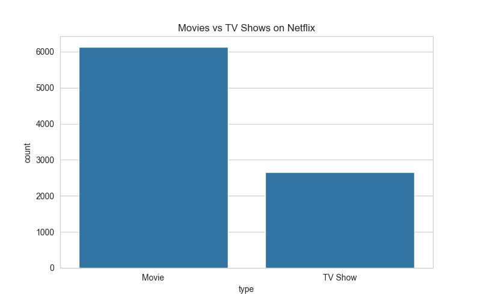
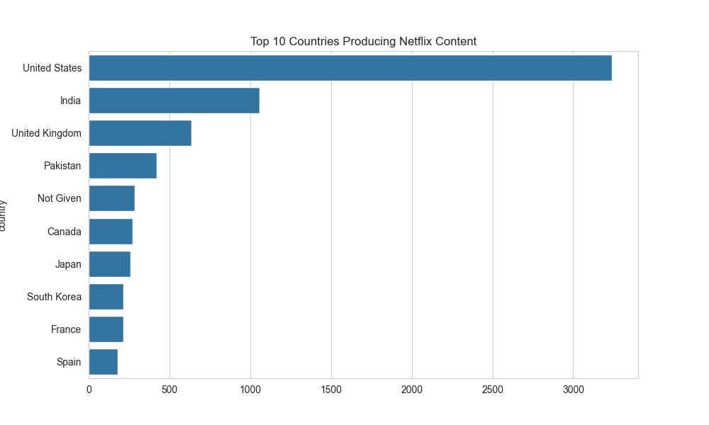
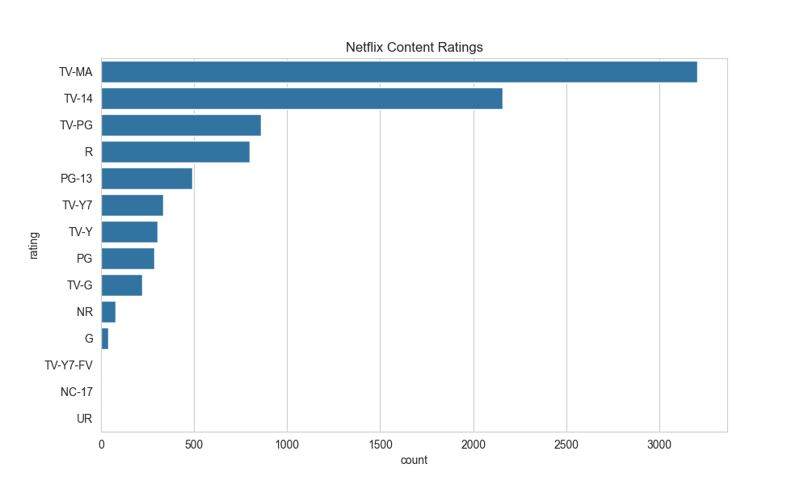
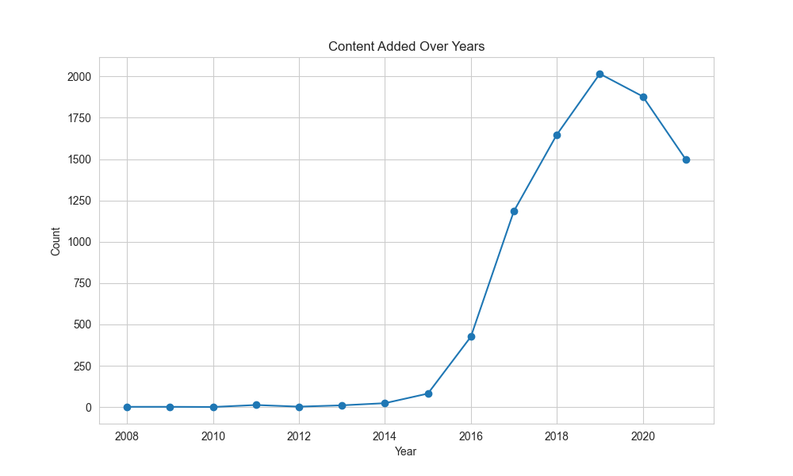
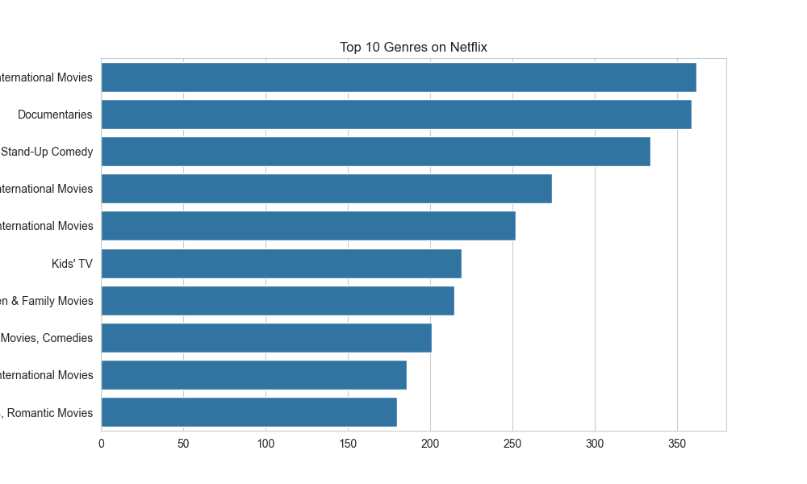
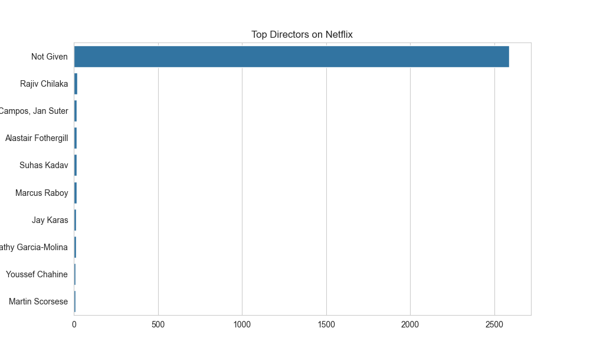
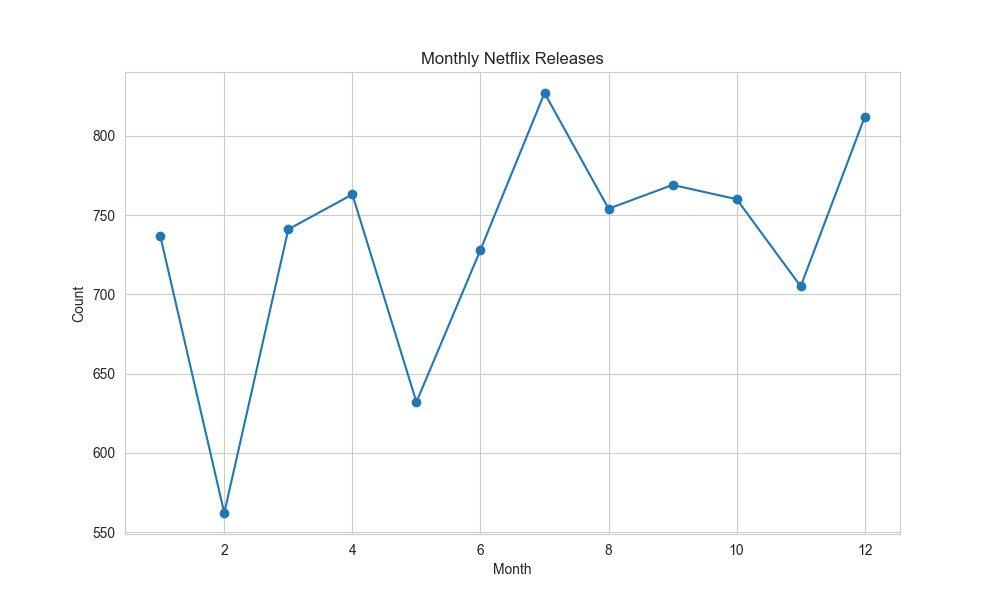
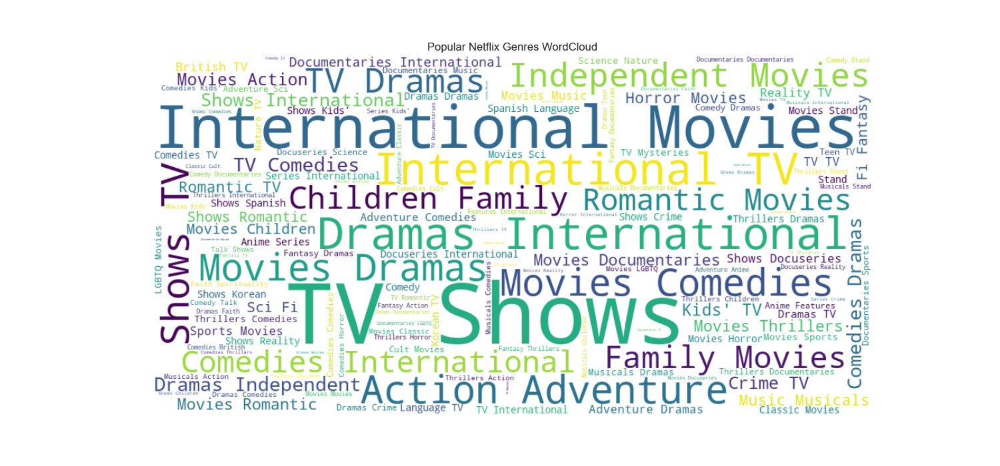
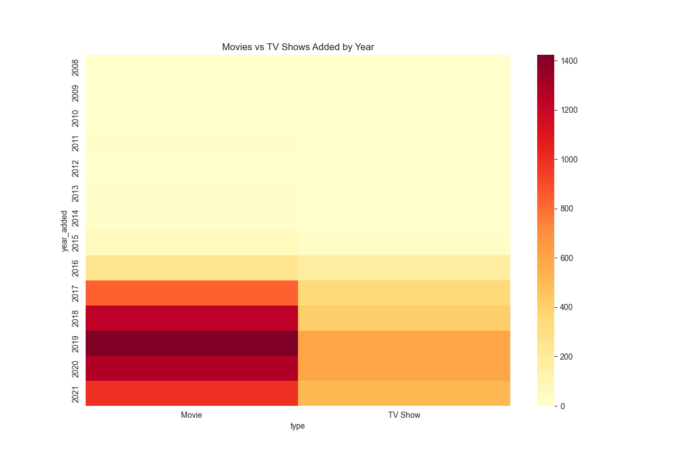
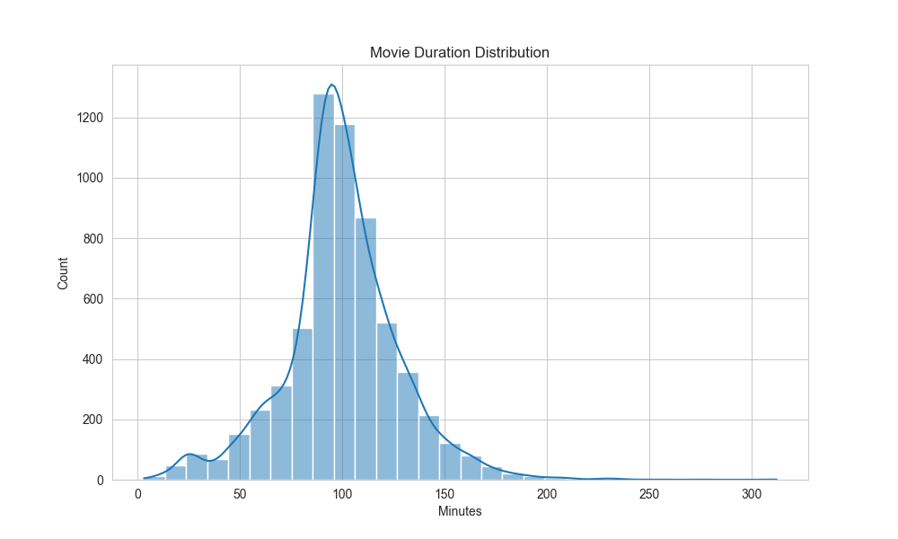

# 🎬 Netflix Data Cleaning, Analysis & Visualization

## 📌 Project Overview

This project performs data cleaning, exploratory data analysis (EDA), and visualization on the Netflix dataset to uncover trends in movies and TV shows available on Netflix.

---

## 🎯 Objectives

* Clean missing and inconsistent data
* Analyze Netflix content trends
* Visualize countries, genres, ratings, directors, and release patterns
* Generate meaningful business insights

---

## 🛠️ Tools & Technologies

* Python
* Pandas
* NumPy
* Matplotlib
* Seaborn
* WordCloud
* Jupyter Notebook

---

## 📊 Key Visualizations

### Movies vs TV Shows

### Top Countries

### Ratings Distribution

### Content Added Over Years

### Top Genres

### Top Directors

### Monthly Releases

### Genres WordCloud

### Heatmap by Year

### Movie Duration

---

## 🧠 Key Insights

* Netflix has more Movies than TV Shows
* United States contributes highest content volume
* TV-MA and TV-14 are dominant ratings
* Content additions increased rapidly after 2015
* Drama, Comedy, and International content are highly common
* Some directors contribute multiple titles consistently

---

## 📌 Conclusion

Netflix content has grown significantly over time with movies dominating the platform. Geographic diversity, changing ratings mix, and genre variety highlight evolving viewer preferences.

---

## 🚀 Future Improvements

* Build recommendation system
* Dashboard using Power BI / Streamlit
* Sentiment analysis on descriptions

---

## 👨‍💻 Author

Rushikesh Maishmale
